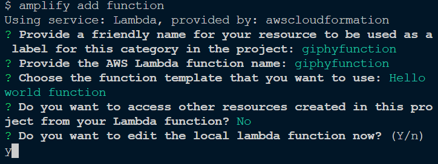

# GraphQL App Recipes

> This repo is an evolving work in progress. As I add more recipes, I will break these out into individual full-stack applications including the front end and adding additional examples. If you have any ideas, please feel free to either contribute or submit an issue!

This repo goes along with the [tutorial on building AWS AppSync APIs using the Amplify GraphQL Transform library](https://dev.to/open-graphql/graphql-recipes-building-apis-with-graphql-transform-3jp0).

To learn more about GraphQL Transform library, check out [the documentation](https://aws-amplify.github.io/docs/cli-toolchain/graphql?sdk=js).

To learn more about building full stack serverless applications with GraphQL and AWS Amplify, check out my post [Infrastructure as Code in the Era of GraphQL and Full Stack Serverless](https://dev.to/dabit3/infrastructure-as-code-in-the-era-of-graphql-and-full-stack-serverless-11bc).

1. [Todo App](https://github.com/dabit3/graphql-recipes#user-content-todo-app)
2. [Events App](https://github.com/dabit3/graphql-recipes#user-content-event-app)
3. [Chat App](https://github.com/dabit3/graphql-recipes#user-content-chat-app)
4. [E Commerce App](https://github.com/dabit3/graphql-recipes#user-content-e-commerce-app)
5. [WhatsApp Clone](https://github.com/dabit3/graphql-recipes#user-content-whatsapp-clone)
6. [Reddit Clone](https://github.com/dabit3/graphql-recipes#user-content-reddit-clone)
7. [Conference App](https://github.com/dabit3/graphql-recipes#user-content-conference-app)
8. [Instagram Clone](https://github.com/dabit3/graphql-recipes#instagram-clone)
9. [Giphy Clone](https://github.com/dabit3/graphql-recipes#giphy-clone)

## Todo App

To deploy this app, use the following steps:

1. Create the Amplify project in your app

```sh
amplify init
```

2. Add the GraphQL API

```sh
amplify add api
```

Use the following schema

```graphql
type Todo @model {
  id: ID!
  name: String!
  description: String
}
```

3. Deploy the resources

```sh
amplify push
```

## Event App

To deploy this app, use the following steps:

1. Create the Amplify project in your app

```sh
amplify init
```

2. Add authentication

```sh
amplify add auth
```

3. Add the GraphQL API

```sh
amplify add api
```

Use the following schema

```graphql
type Event
  @model
  @key(
    name: "queryName"
    fields: ["queryName", "time"]
    queryField: "eventsByDate"
  )
  @auth(
    rules: [
      { allow: groups, groups: ["Admin"], operations: [create, update, delete] }
    ]
  ) {
  id: ID!
  name: String!
  description: String
  time: String!
  queryName: String!
}
```

4. Deploy the resources

```sh
amplify push
```

## Chat App

> Click [here](https://github.com/aws-samples/aws-appsync-chat) to view AWS AppSync Chat, a completed full-stack version of this app built with React.

To deploy this app, use the following steps:

1. Create the Amplify project in your app

```sh
amplify init
```

2. Add authentication

```sh
amplify add auth
```

3. Add the GraphQL API

```sh
amplify add api
```

Use the following GraphQL Schema:

```graphql
type User
  @model
  @auth(
    rules: [
      { allow: owner, ownerField: "id", operations: [create, update, delete] }
    ]
  ) {
  id: ID!
  username: String!
  conversations: [ConvoLink] @connection(name: "UserLinks")
  messages: [Message] @connection(name: "UserMessages")
  createdAt: String
  updatedAt: String
}

type Conversation
  @model(subscriptions: null)
  @auth(rules: [{ allow: owner, ownerField: "members" }]) {
  id: ID!
  messages: [Message] @connection(name: "ConvoMsgs", sortField: "createdAt")
  associated: [ConvoLink] @connection(name: "AssociatedLinks")
  name: String!
  members: [String!]!
  createdAt: String
  updatedAt: String
}

type Message
  @model(subscriptions: null, queries: null)
  @auth(rules: [{ allow: owner, ownerField: "authorId" }]) {
  id: ID!
  author: User @connection(name: "UserMessages", keyField: "authorId")
  authorId: String
  content: String!
  conversation: Conversation!
    @connection(name: "ConvoMsgs", sortField: "createdAt")
  messageConversationId: ID!
  createdAt: String
  updatedAt: String
}

type ConvoLink
  @model(
    mutations: { create: "createConvoLink", update: "updateConvoLink" }
    queries: null
    subscriptions: null
  ) {
  id: ID!
  user: User! @connection(name: "UserLinks")
  convoLinkUserId: ID
  conversation: Conversation! @connection(name: "AssociatedLinks")
  convoLinkConversationId: ID!
  createdAt: String
  updatedAt: String
}

type Subscription {
  onCreateConvoLink(convoLinkUserId: ID!): ConvoLink
    @aws_subscribe(mutations: ["createConvoLink"])
  onCreateMessage(messageConversationId: ID!): Message
    @aws_subscribe(mutations: ["createMessage"])
}
```

4. Deploy the resources

```sh
amplify push
```

## E-commerce App

To deploy this app, use the following steps:

1. Create the Amplify project in your app

```sh
amplify init
```

2. Add authentication

```sh
amplify add auth
```

3. Add the GraphQL API

```sh
amplify add api
```

Use the following GraphQL schema:

```graphql
# Products - Orders - Customers

type Customer
  @model
  @auth(rules: [{ allow: owner }, { allow: groups, groups: ["Admin"] }]) {
  id: ID!
  name: String!
  email: String!
  address: String
}

type Product
  @model
  @auth(
    rules: [
      { allow: groups, groups: ["Admin"], operations: [create, update, delete] }
    ]
  ) {
  id: ID!
  name: String!
  description: String
  price: Float!
  image: S3Object
}

type S3Object {
  bucket: String!
  region: String!
  key: String!
}

type Order
  @model
  @auth(rules: [{ allow: owner }, { allow: groups, groups: ["Admin"] }]) {
  id: ID!
  customer: Customer @connection
  total: Float!
  order: String
}
```

4. Add Storage (S3)

```sh
amplify add storage

? Please select from one of the below mentioned services (Use arrow keys): Content (Images, audio, video, etc.)
? Please provide a friendly name for your resource that will be used to label this category in the project: imagestorage
? Please provide bucket name: <UNIQUE_BUCKET_NAME>
? Who should have access: Auth users only
? What kind of access do you want for Authenticated users? create/update, read, delete
```

5. Deploy the resources

```sh
amplify push
```

## Whatsapp Clone

To deploy this app, use the following steps:

1. Create the Amplify project in your app

```sh
amplify init
```

2. Add authentication

```sh
amplify add auth
```

3. Add the GraphQL API

```sh
amplify add api
```

Use the following GraphQL schema:

```graphql
type User
  @model
  @auth(
    rules: [
      { allow: owner, ownerField: "id", operations: [create, update, delete] }
    ]
  ) {
  id: ID!
  username: String!
  avatar: S3Object
  conversations: [ConvoLink] @connection(name: "UserLinks")
  messages: [Message] @connection(name: "UserMessages")
  createdAt: String
  updatedAt: String
}

type Conversation
  @model(subscriptions: null)
  @auth(rules: [{ allow: owner, ownerField: "members" }]) {
  id: ID!
  messages: [Message] @connection(name: "ConvoMsgs", sortField: "createdAt")
  associated: [ConvoLink] @connection(name: "AssociatedLinks")
  name: String!
  members: [String!]!
  createdAt: String
  updatedAt: String
}

type Message
  @model(subscriptions: null, queries: null)
  @auth(rules: [{ allow: owner, ownerField: "authorId" }]) {
  id: ID!
  author: User @connection(name: "UserMessages", keyField: "authorId")
  authorId: String
  content: String!
  image: S3Object
  conversation: Conversation!
    @connection(name: "ConvoMsgs", sortField: "createdAt")
  messageConversationId: ID!
  createdAt: String
  updatedAt: String
}

type ConvoLink
  @model(
    mutations: { create: "createConvoLink", update: "updateConvoLink" }
    queries: null
    subscriptions: null
  ) {
  id: ID!
  user: User! @connection(name: "UserLinks")
  convoLinkUserId: ID
  conversation: Conversation! @connection(name: "AssociatedLinks")
  convoLinkConversationId: ID!
  createdAt: String
  updatedAt: String
}

type Subscription {
  onCreateConvoLink(convoLinkUserId: ID!): ConvoLink
    @aws_subscribe(mutations: ["createConvoLink"])
  onCreateMessage(messageConversationId: ID!): Message
    @aws_subscribe(mutations: ["createMessage"])
}

type S3Object {
  bucket: String!
  region: String!
  key: String!
}
```

4. Add Storage (S3)

```sh
amplify add storage

? Please select from one of the below mentioned services (Use arrow keys): Content (Images, audio, video, etc.)
? Please provide a friendly name for your resource that will be used to label this category in the project: imagestorage
? Please provide bucket name: <UNIQUE_BUCKET_NAME>
? Who should have access: Auth users only
? What kind of access do you want for Authenticated users? create/update, read, delete
```

5. Deploy the resources

```sh
amplify push
```

## Reddit clone

To deploy this app, use the following steps:

1. Create the Amplify project in your app

```sh
amplify init
```

2. Add authentication

```sh
amplify add auth
```

3. Add the GraphQL API

```sh
amplify add api
```

Use the following GraphQL Schema:

```graphql
type User
  @model
  @auth(
    rules: [
      { allow: owner, ownerField: "id", operations: [create, update, delete] }
    ]
  ) {
  id: ID!
  username: String!
  posts: [Post] @connection
  createdAt: String
  updatedAt: String
}

type Post
  @model
  @auth(
    rules: [
      { allow: owner, ownerField: "id", operations: [create, update, delete] }
    ]
  ) {
  id: ID!
  postContent: String
  postImage: S3Object
  comments: [Comment] @connection
  votes: Int
}

type Comment
  @model
  @auth(
    rules: [
      {
        allow: owner
        operations: [create]
        operations: [create, update, delete]
      }
    ]
  ) {
  id: ID!
  text: String!
  author: String!
  votes: Int
  post: Post @connection
}

type Vote
  @model
  @key(
    name: "byUser"
    fields: ["createdBy", "createdAt"]
    queryField: "votesByUser"
  ) {
  id: ID!
  postId: ID!
  createdBy: ID!
  createdAt: String!
  vote: VoteType
}

type S3Object {
  bucket: String!
  region: String!
  key: String!
}

input VoteInput {
  type: VoteType!
  id: ID!
}

enum VoteType {
  up
  down
}
```

4. Add Storage (S3)

```sh
amplify add storage

? Please select from one of the below mentioned services (Use arrow keys): Content (Images, audio, video, etc.)
? Please provide a friendly name for your resource that will be used to label this category in the project: imagestorage
? Please provide bucket name: <UNIQUE_BUCKET_NAME>
? Who should have access: Auth users only
? What kind of access do you want for Authenticated users? create/update, read, delete
```

5. Deploy the resources

```sh
amplify push
```

## Conference App

To deploy this app, use the following steps:

1. Create the Amplify project in your app

```sh
amplify init
```

2. Add authentication

```sh
amplify add auth
```

3. Add the GraphQL API

```sh
amplify add api
```

Use the following GraphQL Schema:

```graphql
type Talk
  @model
  @auth(
    rules: [
      { allow: groups, groups: ["Admin"], operations: [create, update, delete] }
    ]
  ) {
  id: ID!
  name: String!
  speakerName: String!
  speakerBio: String!
  time: String
  timeStamp: String
  date: String
  location: String
  summary: String!
  twitter: String
  github: String
  speakerAvatar: String
  comments: [Comment] @connection(name: "TalkComments")
}

type Comment
  @model
  @auth(rules: [{ allow: owner, operations: [create, update, delete] }]) {
  id: ID!
  talkId: ID
  talk: Talk
    @connection(
      sortField: "createdAt"
      name: "TalkComments"
      keyField: "talkId"
    )
  message: String
  createdAt: String
  createdBy: String
  deviceId: ID
}

type Report
  @model
  @auth(
    rules: [
      { allow: owner, operations: [create, update, delete] }
      { allow: admin }
    ]
  ) {
  id: ID!
  commentId: ID!
  comment: String!
  talkTitle: String!
  deviceId: ID
}

type ModelCommentConnection {
  items: [Comment]
  nextToken: String
}

type Query {
  listCommentsByTalkId(talkId: ID!): ModelCommentConnection
}

type Subscription {
  onCreateCommentWithId(talkId: ID!): Comment
    @aws_subscribe(mutations: ["createComment"])
}
```

4. Deploy the resources

```sh
amplify push
```

## Instagram Clone

To deploy this app, use the following steps:

1. Create the Amplify project in your app

```sh
amplify init
```

2. Add authentication

```sh
amplify add auth
```

3. Add the GraphQL API

```sh
amplify add api
```

Use the following GraphQL Schema:

```graphql
type User
  @model
  @auth(
    rules: [
      { allow: owner, ownerField: "id", operations: [create, update, delete] }
    ]
  ) {
  id: ID!
  username: String!
  posts: [Post] @connection
  createdAt: String
  updatedAt: String
}

type Post
  @model
  @auth(rules: [{ allow: owner, operations: [create, update, delete] }]) {
  id: ID!
  postImage: S3Object!
  comments: [Comment] @connection
  likes: Int
}

type Comment
  @model
  @auth(rules: [{ allow: owner, operations: [create, update, delete] }]) {
  id: ID!
  text: String!
  author: String!
  likes: Int
  post: Post @connection
}

type Like
  @model
  @key(
    name: "byUser"
    fields: ["createdBy", "createdAt"]
    queryField: "likesByUser"
  ) {
  id: ID!
  postId: ID!
  createdBy: ID!
  createdAt: String!
  liked: Boolean
}

type Following
  @model
  @key(
    name: "followerId"
    fields: ["followerId", "createdAt"]
    queryField: "listFollowing"
  ) {
  id: ID
  followerId: ID!
  followingId: ID!
  createdAt: String!
}

type S3Object {
  bucket: String!
  region: String!
  key: String!
}
```

4. Add Storage (S3)

```sh
amplify add storage

? Please select from one of the below mentioned services (Use arrow keys): Content (Images, audio, video, etc.)
? Please provide a friendly name for your resource that will be used to label this category in the project: imagestorage
? Please provide bucket name: <UNIQUE_BUCKET_NAME>
? Who should have access: Auth users only
? What kind of access do you want for Authenticated users? create/update, read, delete
```

5. Deploy the resources

```sh
amplify push
```

---

To learn more about uploading images in a GraphQL application with Amplify and AppSync, check out my tutorial [How to Manage Image & File Uploads & Downloads with AWS AppSync & AWS Amplify](https://dev.to/dabit3/graphql-tutorial-how-to-manage-image-file-uploads-downloads-with-aws-appsync-aws-amplify-hga)

## Giphy Clone

To deploy this app, use the following steps:

1. Create the Amplify project in your app

```sh
amplify init
```

2. Add a lambda function

```sh
amplify add function
```

3. Enter the following when prompted
   

4. From the root of your project, change into your function's source directory

```sh
cd amplify/backend/function/giphyfunction/src
```

5. Install [axios](https://www.npmjs.com/package/axios) and [dotenv](https://www.npmjs.com/package/dotenv)

```sh
npm install axios && npm install -D dotenv
```

6. Update the contents of your functions `index.js` file

```js
const axios = require("axios");
const dotenv = require("dotenv");
dotenv.config();

exports.handler = (event, _, callback) => {
  const { GIPHY_API_KEY } = process.env;
  let apiUrl = `https://api.giphy.com/v1/gifs/search?api_key=${GIPHY_API_KEY}&q=hello`;

  if (event.arguments) {
    const { searchTerm = "hi", limit = 25 } = event.arguments;
    apiUrl = `https://api.giphy.com/v1/gifs/search?api_key=${GIPHY_API_KEY}&q=${searchTerm}&limit=${limit}`;
  }

  axios
    .get(apiUrl)
    .then(response => callback(null, response.data.data))
    .catch(err => callback(err));
};
```

7. Login to [Giphy's Developer portal](https://developers.giphy.com/dashboard/) and create an app to get an API Key.

8. Back in the function's `src` directory, create a `.env` file and add in the API Key that was obtained in the previous step as a secret.

```sh
GIPHY_API_KEY=<YOUR_API_KEY>
```

**Your .env file should NOT be committed to Github**

9. Head back to the root of your project

```sh
cd ../../../../../
```

10. Add the GraphQL API

```sh
amplify add api
```

Use the following GraphQL Schema:

```graphql
type Gif {
  id: ID!
  slug: String!
  images: GifImage!
}

type GifImage {
  original: GifAttributes!
  fixed_width: GifAttributes!
}

type GifAttributes {
  url: String!
  width: String!
  height: String!
}

type Query {
  getGifs(searchTerm: String, limit: Int): [Gif]
    @function(name: "giphyfunction-${env}")
}
```

11. Deploy the Resources

```sh
amplify push
```
